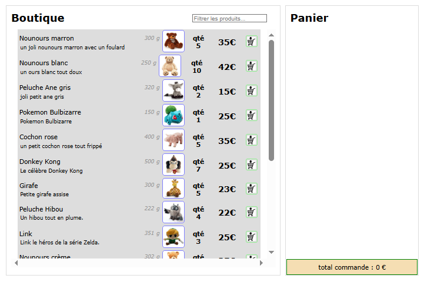
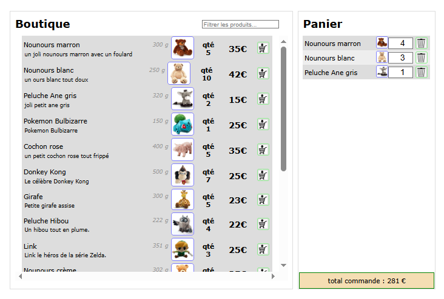

# _Boutique en ligne_ :




## Instructions pour exécuter le projet :

Le dossier `project/` contient la structure du projet. Pour préparer et exécuter le TP, suivez les étapes ci-dessous.

1. **Ouvrez un terminal dans le dossier `../project$`** et installez les dépendances du projet :

```bash
npm install
```

2. **Construisez le bundle JavaScript**

```bash
npm run build
```

3. **Démarrez le serveur de développement**

```bash
npm run dev-server
```

&nbsp;&nbsp;&nbsp;&nbsp;&nbsp;&nbsp;&nbsp;4. **Ouvrez votre navigateur et accédez au site**

```bash
http://localhost:9000/index.html
```

## 📁 Arborescence du projet :

```
📁 project
├─📁 src
│ ├─📁 components
│ │  ├─📝 app.component.jsx
│ │  ├─📝 productList.component.jsx
│ │  ├─📝 forSaleProduct.component.jsx
│ │  ├─📝 product.component.jsx
│ │  ├─📝 shoppingCart.component.jsx
│ │  ├─📝 productInCart.component.jsx
│ │  ├─📝 productFilter.component.jsx
│ │  ├─📝 addToCart.component.jsx
│ │  └─📝 totalCart.component.jsx
│ └─📁 images
│    ├─📝 girafe.jpg
│    └─📝 ...
├─📁 assets
│ └─📁 style
│    ├─📝 app.css
│    ├─📝 cart.css
│    ├─📝 product.css
│    └─📝 productList.css
│
├─📁 ...
├─📄  README.md
|
```
